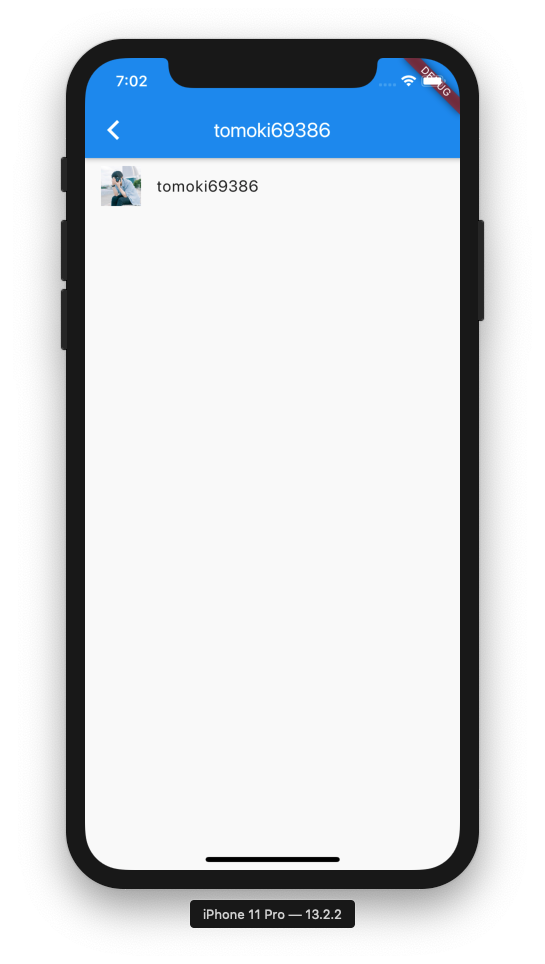

# Flutter GitHub API

```bash
$ flutter run
```


# Snapshot

|                    1                    |                    2                    | 3                                       |
| :-------------------------------------: | :-------------------------------------: | --------------------------------------- |
|  |  |  |

